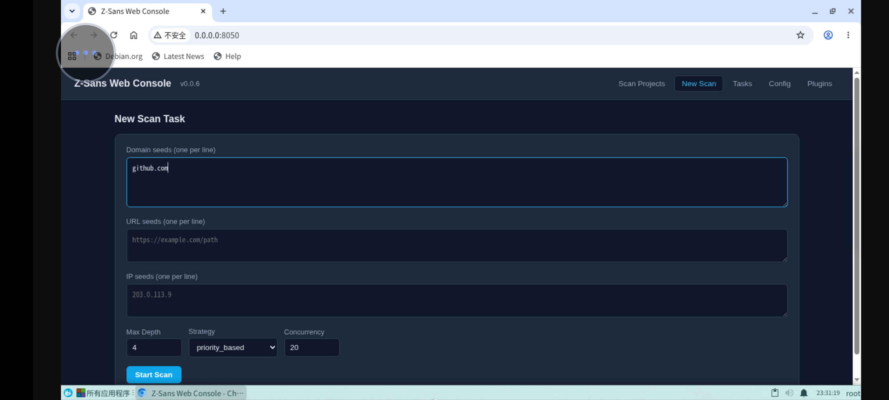
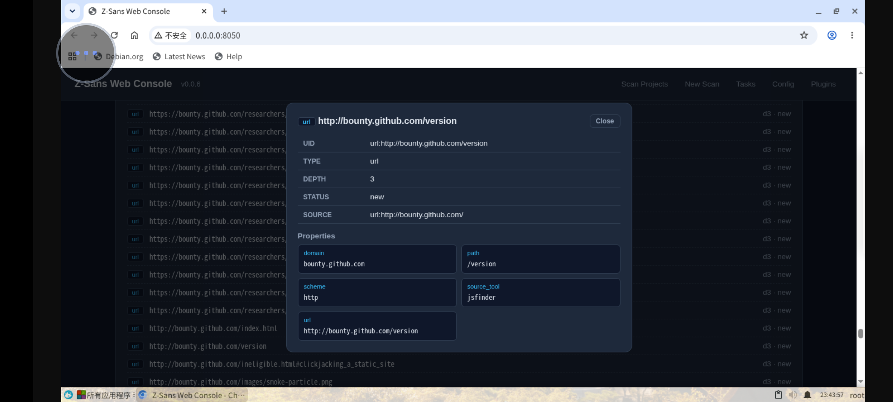
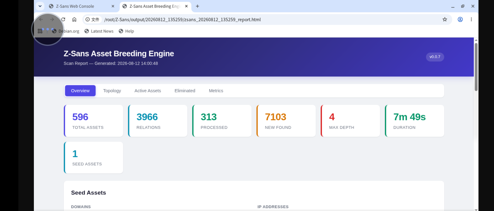

# Z-Sans Asset Breeding Engine

<p align="center">
    
    <h3 align="center">Z-Sans</h3>
    <p align="center">
        🔥 "Automated Asset Collection System Powered by Asset Breeding Engine"
        <br />
        <a href="https://opensource.org/licenses/MIT"></a>
        <a href="https://www.python.org/downloads/release/python-390/"></a>
        <a href="https://github.com/sansjtw1/Z-Sans/releases"></a>
        <br>
        <a href="README.md">English</a> | <a href="README_CN.md">中文</a> | <a href="CHANGELOG.md">Changelog</a>
    </p>
</p>

## 🚀 Project Overview

Z-Sans is a cybersecurity tool built around an innovative **Asset Breeding Engine** that automates attack-surface discovery and mapping. Starting from a small set of seed assets (domains or URLs), Z-Sans systematically discovers and expands digital assets — domains, IP addresses, URLs, ports, and JavaScript resources — applying configurable breeding strategies to grow an asset graph, and then produces detailed reports (JSON, CSV, GraphML, HTML).

## ✨ Key Features

- **Multi-Asset Discovery**: Domains, IPs, URLs, ports, JS files, and their relationships
- **Concurrent Breeding**: Multithreaded asset queue processing for faster scans
- **Configurable Strategies**: `priority_based`, `depth_first`, `breadth_first`, `time_based`
- **Checkpoint & Resume**: Save progress to a checkpoint, resume interrupted scans with `--resume`
- **Change Monitoring**: `--watch` mode rescans on a schedule and reports asset changes via Webhook
- **Flexible Output**: JSON, CSV, GraphML, and localized multi-tab HTML reports
- **Interactive Topology Map**: Canvas-based asset graph with pan/zoom in the HTML report
- **Tool Integration**: Subfinder, naabu, EHole, plus built-in lightweight resolvers
- **Plugin System**: Event-driven plugin framework for custom reports, external intel, Webhook notifications, and more (see the [Plugin Development Guide](plugins/README.md))
- **Internationalization**: Built-in Chinese (zh_CN) and English (en) support
- **Modular Design**: Core engine decoupled from tool implementations for easy extension

## 🛠️ Project Structure

```
Z-Sans/
├── assets/                 # External tool scripts (port scanner, DNS resolver, JSFinder, etc.)
├── core/
│   ├── breeders/           # Asset breeding algorithms per asset type
│   ├── tools/              # Tool integrations and orchestrator
│   ├── i18n.py             # Internationalization
│   ├── output.py           # Report / format exporters
│   └── zsans_engine.py     # Core breeding engine, asset graph, priority queue
├── i18n/                   # Locale resources (en / zh_CN)
├── images/                 # Documentation images
├── plugins/                # Plugin directory (event-driven extensions)
├── templates/              # Config templates
├── breeding-config.yaml    # Main configuration
├── main.py                 # Entry point / CLI
└── requirements.txt        # Python dependencies
```

## 🧩 Plugin System

Z-Sans ships with an event-driven plugin framework: drop any `.py` file into the `plugins/` directory and it is auto-loaded, receiving scan-lifecycle events as they fire. Use it for custom reports, external threat intelligence (e.g. Shodan), vulnerability scanning, Webhook notifications, audit logging, and more.

- **Zero-config loading**: `.py` files under `plugins/` auto-register — no main-program changes needed
- **8 event hooks**: `on_scan_started` / `on_scan_completed` / `on_scan_stopped` / `on_asset_scanned` / `on_asset_discovered` / `on_asset_excluded` / `on_asset_eliminated` / `on_asset_failed`
- **Unified output**: plugin artifacts land in the same `output/<timestamp>/` subdirectory as the main output
- **Management commands**: `--list-plugins` to list loaded plugins, `--plugin-info <name>` for details
- **Config switch**: disable individual plugins via `plugins.disabled` in `breeding-config.yaml`

See the **[Plugin Development Guide](plugins/README.md)** for the full authoring guide.

## 💡 Installation

### Requirements

- Python 3.9+
- OS: Windows / Linux / macOS

### Steps

```bash
git clone https://github.com/sansjtw1/Z-Sans.git
cd Z-Sans
pip install -r requirements.txt
```

Optional: point subfinder / naabu / ehole paths under `external_tools.paths` in `breeding-config.yaml`.

## 📋 Usage

```bash
# Scan from a domain seed
python main.py -d example.com

# Scan from URL seeds
python main.py -u https://example.com

# Custom config and output dir
python main.py -c your-config.yaml -d example.com -o results

# Verbose logging
python main.py -d example.com -v

# Resume a previous interrupted scan
python main.py -d example.com --resume

# Continuous change monitoring (delta + webhook alerts)
python main.py -d example.com --watch

# Set max discovery depth
python main.py -d example.com --depth 4

# Start the web console (project browser, live task logs, config/plugin management)
python main.py --web

# Web console on a custom port
python main.py --web --port 9000
```

### Command Line Options

```
-c, --config    Config file path (default: breeding-config.yaml)
-d, --domain    Add domain seed (repeatable)
-u, --url       Add URL seed (repeatable)
-o, --output    Output directory (default: output)
-v, --verbose   Verbose output
--init          Create a default config file
--version       Show version
--depth         Max discovery depth
--resume        Continue from the last checkpoint
--watch         Periodic rescan + change reporting + webhook push
--web           Start the web console (default port: 8050)
--port          Web console port
--list-plugins  List loaded plugins and exit
--plugin-info   Show details for a plugin by name
```

### 🌐 Web Console

The web console is a browser-based management interface for scan projects, live tasks, configuration, and plugins. It is served entirely by the standard library — no separate frontend build or external CDN is required.

```bash
python main.py --web            # http://0.0.0.0:8050
python main.py --web --port 9000
```

Features:

- **Project browser** — browse historical scan runs under `output/`, view the asset graph, analysis charts, and interactive topology
- **New scan task** — start scans from domain / URL / IP seeds with custom depth, strategy, and concurrency, all in a background thread
- **Live tasks** — real-time streaming logs (SSE), stop / rescan completed runs
- **Config editor** — view and edit `breeding-config.yaml` online with YAML validation
- **Plugin manager** — enable / disable plugins without restarting
- **Project compare** — diff two runs to find assets only present in either




## 💻 Configuration

Main sections of `breeding-config.yaml`:

- `strategy` — breeding strategy: `priority_based` / `depth_first` / `breadth_first` / `time_based`
- `asset_scope` — restrict results to seed domains / IP ranges, include subdomains
- `concurrency.max_tasks` — number of parallel asset-processing workers
- `max_depth` — global breeding depth
- `asset_types` — per-type enable switches, depth limits, priorities, and tool toggles
- `resource_limits` — maximum counts per asset type
- `checkpoint` — enable/disable resume, save interval, checkpoint file path
- `monitoring` — `--watch` interval and Webhook URL for change alerts
- `output` — output dir, format toggles, keep eliminated assets, auto-open report
- `external_tools.paths` — paths to subfinder / naabu / ehole
- `language.default_language` — `en` or `zh_CN`
- `exclusions` — domains / IPs / URL keywords / regex patterns to skip
- `http` — timeout, retries, user-agent, SSL verification, proxy, redirects behavior

### Example: Checkpoint & Monitoring

```yaml
max_depth: 4
concurrency:
  max_tasks: 20

output:
  dir: output
  formats:
    json: true
    csv: true
    graphml: true
    html: true

checkpoint:
  enabled: true        # save progress periodically
  interval: 50         # every N assets processed
  file: null           # default: <output_dir>/<timestamp>/checkpoint.json

monitoring:
  enabled: false
  interval: 3600       # re-scan every hour
  webhook_url: null    # POST JSON change notifications when set
```

## 🎯 Output

Each scan writes to a timestamped subdirectory under `output/`, containing:

- `*.json` — full asset graph (format: `json` / `graphml`)
- `*_assets.csv` / `*_relations.csv` — assets and relations (for Excel-friendly)
- `*_graphml` — GraphML relationship graph
- `*_report.html` — interactive report with Overview, Topology, Active Assets, Eliminated, and Metrics tabs (filters, search and topology drag/zoom)



## 📃 Disclaimer

> **Important:** Use Z-Sans only on systems you are explicitly authorized to test.
> Operators must comply with all applicable laws and regulations; the developers assume
> no liability for misuse or any direct/indirect damage caused by the tool.

## 🤝 Contributing

We welcome contributions. Please fork, branch, commit, and open a pull request. Spanish or Chinese improvements are appreciated.

## 📃 License

MIT — see [LICENSE](LICENSE).

## 📞 Contact

Email: sansjtw@163.com
GitHub: https://github.com/sansjtw1
Telegram: https://t.me/sansjtw