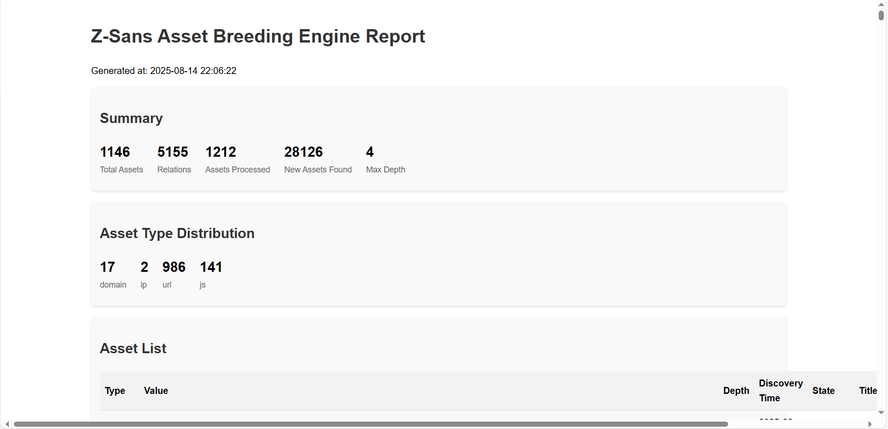

# Z-Sans 资产繁殖引擎
<p align="center">
    
  </a>
  <h3 align="center">Z-Sans</h3>
  <p align="center">
    🔥 “基于资产繁殖引擎的自动化资产收集系统”
    <br />
    <a href="https://opensource.org/licenses/MIT"></a>
    <a href="https://www.python.org/downloads/release/python-390/"></a>
    <a href="https://github.com/sansjtw1/Z-Sans/issues"></a>
    <br>
    <a href="README.md">README</a> | <a href="README_CN.md">中文文档</a>
  </p>

## 🚀 项目简介

Z-Sans 是一个强大的网络安全工具，专注于​​自动化资产发现与繁殖​​，帮助安全团队快速识别和映射组织的完整攻击面。通过少量种子资产（域名或URL），Z-Sans 能够自动化发现关联资产，例如域、IP、URL、端口和 JavaScript 资源。同时提供详细的资产报告。

## ✨ 功能特点

- **多类型资产支持**：域名、IP、URL、端口和JS文件等
- **可配置的扫描策略**：基于优先级的扫描策略，支持自定义深度和并发控制
- **丰富的工具集成**：支持 subfinder、naabu、subfinder 等多种外部工具
- **灵活的输出格式**：支持 JSON、CSV、GraphML 和 HTML 等多种格式输出
- **国际化支持**：内置中英文语言支持
- **详细的日志系统**：支持不同级别的日志输出，便于调试和监控
- **模块化设计**：核心功能与工具实现分离，易于扩展
- **轻量级工具**: 更加轻量，专注资产拓扑发现
- **自动化资产繁殖**: 基于资产发现，自动发现关联资产

## 🛠️ 项目结构

```
Z-Sans/
├── assets/             # 外部工具脚本
├── core/               # 核心代码
│   ├── breeders/       # 繁殖器实现
│   ├── tools/          # 工具封装
│   ├── i18n.py         # 国际化支持
│   ├── output.py       # 输出处理
│   └── zsans_engine.py # 核心引擎
├── i18n/               # 国际化资源
├── output/             # 输出目录
├── templates/          # 模板文件
├── breeding-config.yaml # 配置文件
├── main.py             # 入口文件
├── README.md           # 本自述文件
└── requirements.txt    # 依赖列表
```

## 💡 安装指南

### 环境要求
- Python 3.9+ 
- 支持的操作系统: Windows, Linux, macOS

### 安装步骤

1. 克隆项目仓库

```bash
git clone https://github.com/sansjtw1/Z-Sans.git
cd Z-Sans
```

2. 安装依赖

```bash
pip install -r requirements.txt
```

3. 配置外部工具（可选）

根据需要在 `breeding-config.yaml` 中配置外部工具路径，如 subfinder、naabu 等。

## 📋 使用方法

> 一些大型企业资产、资产较多可能会导致繁殖时间较长。

### 基本使用

```bash
# 使用默认配置运行
python main.py -d example.com

# 使用 URL 种子资产
python main.py -u https://example.com

# 指定配置文件
python main.py -c your-config.yaml -d example.com

# 详细输出模式
python main.py -d example.com -v

# 指定输出目录
python main.py -d example.com -o your-output-dir
```

### 命令行参数

```
-c, --config     配置文件路径（默认：breeding-config.yaml）
-d, --domain     添加域名种子（可多次指定）
-u, --url        添加URL种子（可多次指定）
-o, --output     输出目录（默认：output）
-v, --verbose    详细输出模式
--init           创建默认配置文件
--version        显示版本信息
--depth          设置最大扫描深度
```

## 💻 配置说明

配置文件 `breeding-config.yaml` 包含以下主要部分：

### 策略配置
```yaml
strategy: priority_based  # 基于优先级的策略
```

### 配置中文
```yaml
language:
  default_language: zh_CN  # 配置语言 (zh_CN 或 en)
  supported_languages:     # 支持的语言
    - zh_CN
    - en
  locale_dir: i18n         # 本地化文件目录
```

### 资产范围配置
```yaml
asset_scope:
  restrict_to_seed_domains: true    # 限制在种子域名范围内
  restrict_to_seed_ip_ranges: false  # 不限制在种子IP范围内
  include_subdomains: true          # 包含子域名
  include_ip_ranges: true           # 包含IP范围
```

### 并发配置
```yaml
concurrency:
  max_tasks: 20        # 最大并发任务数
  tools:               # 工具并发设置
    subfinder: 2       # 子域名发现工具并发数
    naabu: 2           # 端口扫描工具并发数
    jsfinder: 2        # JS文件发现工具并发数
```

### 资源限制
```yaml
resource_limits:
  max_domains: 2000    # 最大域名数量
  max_ips: 2000        # 最大IP数量
  max_urls: 5000       # 最大URL数量
  max_ports: 5000      # 最大端口数量
  max_js: 2000         # 最大JS文件数量
```

## 🎯 输出示例

运行后，结果将保存在指定的输出目录中，包含以下文件：
- JSON格式的资产数据
- CSV格式的资产和关系数据
- GraphML格式的资产关系图
- HTML格式的报告



## 📃 免责声明
​​重要提示：​​ 使用Z-Sans前请务必阅读并理解以下免责声明：
1. ​​合法使用​​
Z-Sans仅限用于​​合法授权的安全评估、渗透测试和研究目的​​。用户需确保在目标系统所有者明确授权的前提下使用本工具。

2. ​​禁止非法活动​​
严格禁止将Z-Sans用于任何非法活动，包括但不限于：
• 未经授权的系统扫描
• 侵犯他人隐私
• 破坏计算机系统
• 窃取敏感信息

3. ​​责任限制​​
开发者对使用Z-Sans造成的任何直接或间接损失不承担责任。用户需自行承担使用本工具的所有风险。
4. ​​遵守法律法规​​
用户在使用Z-Sans时必须遵守所有适用的国家/地区法律法规。
5. ​​道德准则​​
我们鼓励用户遵守安全研究的道德准则，负责任地披露发现的安全问题。

## 🎈 贡献指南

欢迎贡献代码、报告问题或提出建议！

## 📃 许可证

本项目采用 MIT 许可证 - 详情请见 [LICENSE](LICENSE) 文件。

## 📞 联系信息
sansjtw@163.com